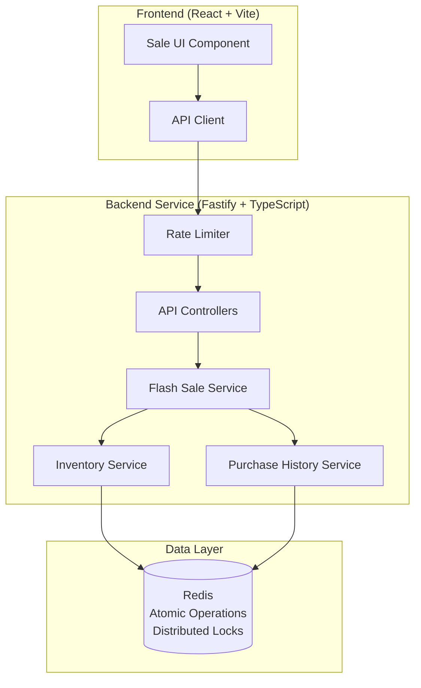
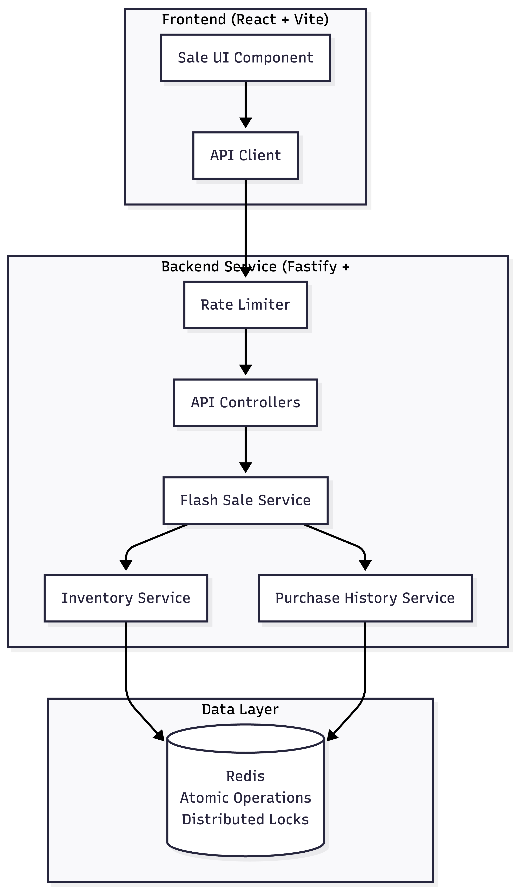

# Flash Sale System

A robust, scalable backend system for handling high-traffic flash sales with strict inventory control and one-item-per-user enforcement.

## Overview

This project implements a flash sale platform designed to handle thousands of concurrent purchase attempts for a limited-stock product. The system ensures:

- **No overselling**: Atomic operations guarantee stock never goes negative
- **One item per user**: Each user can only purchase once
- **High throughput**: Optimized for thousands of concurrent requests
- **Configurable sale windows**: Start/end times are fully configurable

## System Architecture





### Key Components

| Component | Technology | Purpose |
|-----------|------------|---------|
| **Backend** | Fastify + TypeScript | High-performance API server |
| **Frontend** | React + Vite | User interface for flash sale |
| **Cache/State** | Redis | Atomic operations, stock management |
| **Testing** | Vitest + k6 | Unit, integration, and stress tests |

## 🔧 Design Decisions & Trade-offs

### 1. Why Fastify over Express?

Fastify is the fastest Node.js web framework, handling ~30% more requests per second than Express. For a flash sale with thousands of concurrent users, this performance difference is significant.

### 2. Why Redis Lua Scripts?

The most critical challenge is preventing overselling. We use Redis Lua scripts for atomic operations:

```lua
-- Atomic stock decrement with guard
local stock = redis.call('GET', KEYS[1])
if tonumber(stock) > 0 then
    redis.call('DECR', KEYS[1])
    return 1  -- Success
end
return 0  -- Out of stock
```

**Benefits:**
- Lua scripts execute atomically - no race conditions possible
- Single network round-trip to Redis
- Scales horizontally with Redis Cluster

### 3. One-Item-Per-User: Why HSETNX?

We use Redis `HSETNX` (Hash Set if Not Exists) for atomic duplicate prevention:
- Returns 1 if user is new (set succeeded)
- Returns 0 if user already exists
- Atomic operation - no race conditions

### 4. Trade-offs Acknowledged

| Decision | Trade-off | Mitigation |
|----------|-----------|------------|
| Redis for all state | Single point of failure | Use Redis Cluster/Sentinel in production |
| In-memory rate limiting | Per-instance limits | Redis-based rate limiting for distributed deployment |
| Polling vs WebSocket | Higher latency | Acceptable for this use case; WebSocket recommended for real-time |

## 🚀 Getting Started

### Prerequisites

- **Node.js** 18+ 
- **Redis** 6+ (or Docker)
- **k6** (for stress testing)

### Option 1: Local Development

#### 1. Start Redis

Using Docker:
```bash
docker run -d --name redis -p 6379:6379 redis:7-alpine
```

Or install locally via Homebrew:
```bash
brew install redis
brew services start redis
```

#### 2. Start Backend

```bash
cd backend
npm install
npm run dev
```

The server will start on `http://localhost:3001`

#### 3. Start Frontend

```bash
cd frontend
npm install
npm run dev
```

The frontend will be available at `http://localhost:5173`

### Option 2: Docker Compose

```bash
docker-compose up --build
```

This starts Redis, backend, and frontend together.

## 📡 API Endpoints

### GET /api/sale/status

Returns current sale status.

**Response:**
```json
{
  "status": "active",
  "startsAt": "2024-02-05T15:00:00Z",
  "endsAt": "2024-02-05T16:00:00Z",
  "remainingStock": 95,
  "totalStock": 100,
  "productName": "Limited Edition Flash Sale Item",
  "productPrice": 99.99,
  "serverTime": "2024-02-05T15:05:00Z"
}
```

### POST /api/sale/purchase

Attempt to purchase an item.

**Request:**
```json
{ "userId": "user@example.com" }
```

**Success Response (200):**
```json
{
  "success": true,
  "message": "Congratulations! Your purchase was successful.",
  "purchasedAt": "2024-02-05T15:05:30Z"
}
```

**Failure Response (409):**
```json
{
  "success": false,
  "reason": "already_purchased",
  "message": "You have already purchased this item."
}
```

### GET /api/sale/purchase/:userId

Check if a user has made a purchase.

**Response:**
```json
{
  "hasPurchased": true,
  "purchasedAt": "2024-02-05T15:05:30Z"
}
```

## 🧪 Testing

### Unit Tests

```bash
cd backend
npm test
```

Tests for:
- `InventoryService` stock operations
- `PurchaseService` one-item-per-user logic
- `FlashSaleService` orchestration

### Integration Tests

Requires Redis running:

```bash
cd backend
npm run test:integration
```

Tests:
- Full API endpoint functionality
- Concurrent purchase handling
- Edge cases (sold out, sale not active)

### Stress Tests

#### Prerequisites

Install k6:
```bash
# macOS
brew install k6

# Linux
sudo apt-key adv --keyserver hkp://keyserver.ubuntu.com:80 --recv-keys C5AD17C747E3415A3642D57D77C6C491D6AC1D69
echo "deb https://dl.k6.io/deb stable main" | sudo tee /etc/apt/sources.list.d/k6.list
sudo apt-get update && sudo apt-get install k6
```

#### Run Stress Test

```bash
# Make sure backend is running
cd backend/stress-tests
k6 run flash-sale.k6.js
```

#### Test Configuration

The stress test simulates:
- **1000 virtual users** at peak
- **Ramping pattern**: 0 → 100 → 500 → 1000 → 0 users
- **Duration**: ~70 seconds total

#### Expected Results

For a 100-item stock:

| Metric | Expected Value |
|--------|----------------|
| Successful purchases | Exactly 100 |
| Out of stock rejections | Remaining attempts |
| p95 latency | < 100ms |
| HTTP errors | 0% |
| Overselling | 0 items |

Sample output:
```
=== Stress Test Results ===
Initial Stock: 100
Remaining Stock: 0
Items Sold: 100
===========================

✓ No overselling detected - concurrency controls working correctly

     ✓ successful_purchases...: 100
     ✓ out_of_stock...........: 4523
     ✓ http_req_duration......: avg=23.5ms p95=87ms
```

## ⚙️ Configuration

Environment variables:

| Variable | Default | Description |
|----------|---------|-------------|
| `PORT` | 3001 | Server port |
| `REDIS_URL` | redis://localhost:6379 | Redis connection URL |
| `TOTAL_STOCK` | 100 | Initial stock quantity |
| `SALE_START_TIME` | Now + 1 min | Sale start (ISO 8601) |
| `SALE_END_TIME` | Start + 1 hour | Sale end (ISO 8601) |
| `RATE_LIMIT_MAX` | 100 | Max requests per window |
| `CORS_ORIGIN` | http://localhost:5173 | Allowed CORS origin |

## 📁 Project Structure

```
flash-sale-assessment/
├── backend/
│   ├── src/
│   │   ├── config/           # Configuration
│   │   ├── controllers/      # HTTP handlers
│   │   ├── services/         # Business logic
│   │   ├── middleware/       # Rate limiting, error handling
│   │   ├── routes/           # API routes
│   │   ├── utils/            # Redis client, Lua scripts
│   │   └── types/            # TypeScript interfaces
│   ├── tests/
│   │   ├── unit/             # Unit tests
│   │   └── integration/      # API tests
│   └── stress-tests/         # k6 load tests
├── frontend/
│   ├── src/
│   │   ├── components/       # React components
│   │   ├── hooks/            # Custom hooks
│   │   └── services/         # API client
├── docker-compose.yml
└── README.md
```

## 🔮 Production Considerations

For production deployment, consider:

1. **Redis Cluster/Sentinel** for high availability
2. **Load balancer** (Nginx, AWS ALB) for horizontal scaling
3. **Redis-based rate limiting** for distributed environments
4. **WebSocket** for real-time stock updates
5. **PostgreSQL** for durable purchase records
6. **Message queue** (RabbitMQ/SQS) for order processing
7. **CDN** for frontend static assets
8. **Monitoring** (Prometheus, Grafana) for observability

## 📄 License

MIT License
